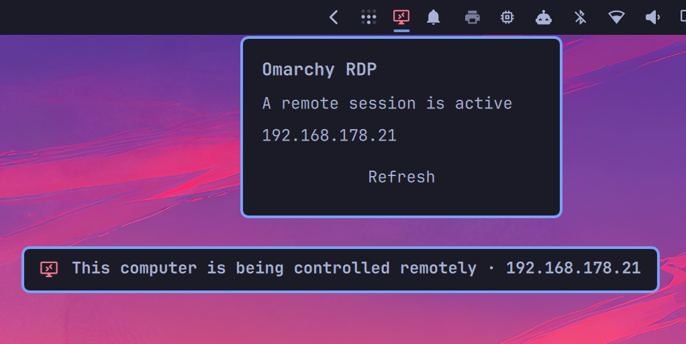

# Omarchy RDP

A small Omarchy bar icon that tells you when someone is controlling this computer over **Remote Desktop Protocol (RDP)** — the same protocol Microsoft Remote Desktop, Windows App, Remmina, and FreeRDP use.



It does **not** start an RDP server. You still need [hypr-rdp](https://github.com/hyprwm/hypr-rdp) (or another RDP server) running on this machine. This plugin only watches for a live connection and makes it obvious.

## Before you start

1. Install `hypr-rdp` on this Omarchy PC.
2. Start it and keep it running:

```sh
systemctl --user enable --now hypr-rdp.service
```

3. From another device, connect with any RDP client (Microsoft Remote Desktop / Windows App, Remmina, FreeRDP, and so on) to this computer’s IP.

If nobody is connected yet, the icon stays dim. That is normal.

## Install

```sh
omarchy plugin add https://github.com/Ruegen/omarchy-rdp-monitor.git --enable
```

The icon appears on the **right** of the bar. To move it:

```sh
omarchy bar move io.github.ruegen.rdp-monitor --section left
```

Or copy this folder to `~/.config/omarchy/plugins/io.github.ruegen.rdp-monitor/` and run `omarchy plugin enable io.github.ruegen.rdp-monitor`.

## What you will see

| | Meaning |
|---|---|
| Dim icon | Nobody is connected |
| Bright icon + notification | A remote desktop client just connected |
| Banner: **This computer is being controlled remotely** + an IP | That machine is in control right now |

Hover or click the icon to see the same IP.

Drag the banner anywhere. Double-click it to put it back under the bar. When they disconnect, the banner goes away and the icon dims again (within a couple of seconds).

## If nothing happens

- Is `hypr-rdp` running? `systemctl --user status hypr-rdp.service`
- Did a client actually connect (not just sit on the login screen of the remote app)?
- Unusual listen port? The plugin follows whatever `hypr-rdp` is using. You can also set **Listen port** on the widget (0 = automatic).

## Remove

```sh
omarchy plugin remove io.github.ruegen.rdp-monitor
```

That removes the widget only. `hypr-rdp` stays installed.

## Update

```sh
omarchy plugin update io.github.ruegen.rdp-monitor
```

## License

MIT. You can use, copy, and modify this plugin, including commercially.
